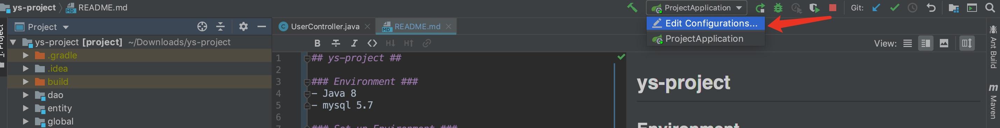

## ys-project ##

### Environment ###
- Java 8
- mysql 5.7

### Set up Environment ###

- 1.

- 2.

- 3.

- 4.`MYSQL_DATABASE` same as your local database name
    
    `MYSQL_USER` root
    
    `MYSQL_PASS` your mysql password
- 5.

- 6.visit `http://localhost:8080/swagger-ui.html#/`